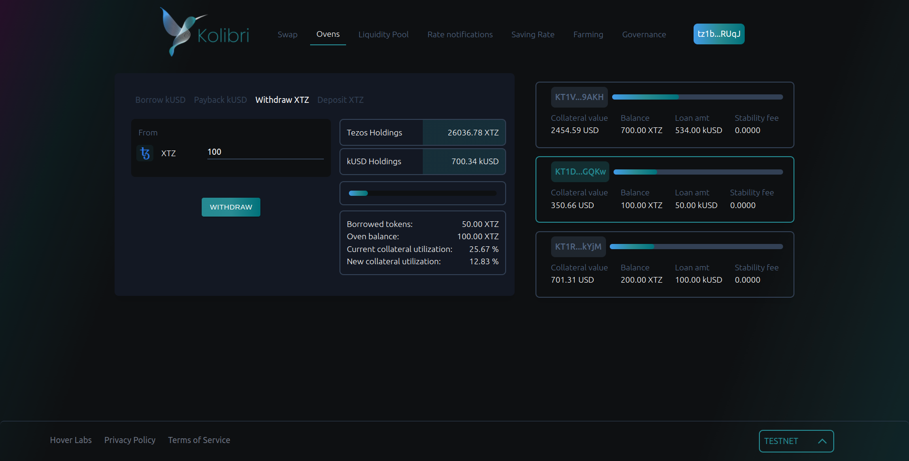
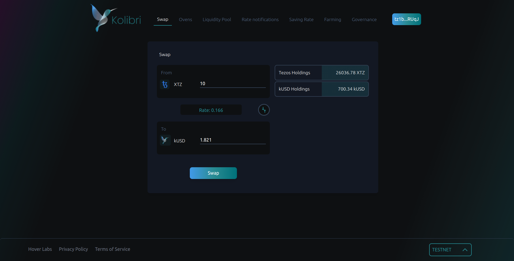
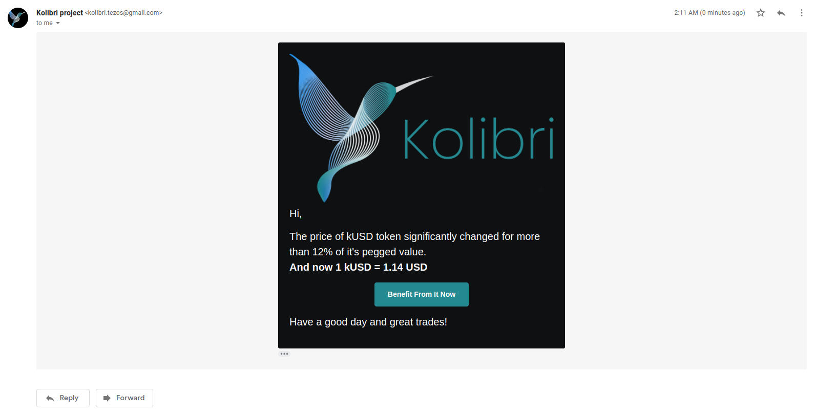

# Alternative front-end for Kolibri protocol

This repo contains code for alternative UI implementation for [Kolibri protocol](https://kolibri.finance/), a self balancing algorithmic stablecoin built on Tezos.

**[Demo of new website](https://alex.dyndns.ws:8086/)**

## Contacts

telegram: [maksim](https://t.me/tiredofbeeing)

mail: maksim.lagus@yandex.ru

## How this project started?

We started development process as a part of [Tezos DeFi Hackathon](https://hackathon2022.tezos.org.ua/en/). While current Kolibri website is a great tech solution, that solves users’ problems, we thought that it lacks **simplicity and clarity** in user experience. After the hackathon finished, our team decided to finish the project, so it would match our vision for the future of DeFi world.

## What's new?

### Dark theme

As case name suggests, our first goal was to built **completely new version of user interface and website design**. We studied best existing projects on DeFi market to introduce our **dark theme** (that was already previously proposed by community). 

### Built-in swap

Also, we present new core feature - **a built-in native swap**. This will provide users with an easy and quick tool to obtain stablecoin, without going into too much details about ovens, minting and soft peg. They can just click a button and get kUSD transfered on their wallets, it's that simple! For now, to get swap tokens we are using liquidity pools hosted by [QuipuSwap](https://quipuswap.com/swap/tez-KT193D4vozYnhGJQVtw7CoxxqphqUEEwK6Vb_0), we were able to reach to MadFish devs during hackathon period. But in the future, with the help of Hover Labs, we hope to host our own pools.

### Rate notifications

By introducing email rate notifications, we solve two problems:

- Users get up to date as fast as possible
- We are in control of kUSD peg to USD

Now we have only implemented notifications by email, but in the future, we plan to also add telegram bot.

## How this works?

### Main stack

- React.js for front-end
- Node.js for SMTP mailing server
- Tailwind for quick styles
- MUI and Headless UI for already-made components

### Libraries and API's

We are using a lot of community made open-source libraries and API's for blockchain interactions, such as:

- [Kolibri.JS](https://github.com/Hover-Labs/kolibri-js)
- [QuipuSwap SDK](https://github.com/madfish-solutions/quipuswap-sdk)
- [Taquito](https://tezostaquito.io/)
- [Beacon wallet](https://docs.walletbeacon.io/)

... and many others

